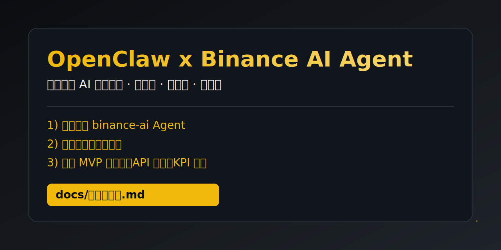
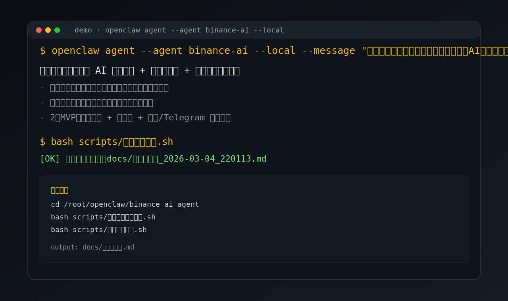

# OpenClaw Binance AI Agent



基于 OpenClaw 的“币安主题 AI Agent”最小可复现项目，包含：

- Agent 配置脚本（自动创建 `binance-ai` Agent）
- 币安创新顾问指令模板（`templates/智能体规则模板.md` / `templates/智能体身份模板.md`）
- 一键图文 Demo 脚本（自动跑多轮问答并生成 Markdown 展示稿）
- 2 分钟中文配音视频自动生成（含音轨导出）

## 首屏演示图



## 演示视频

- 直接下载：[`docs/assets/英文演示视频.mp4`](docs/assets/英文演示视频.mp4)
- 中文配音 2 分钟版：[`docs/assets/中文配音演示视频_2分钟.mp4`](docs/assets/中文配音演示视频_2分钟.mp4)
- 中文配音音轨：[`docs/assets/中文配音音轨.mp3`](docs/assets/中文配音音轨.mp3)
- 重新生成：

```bash
bash scripts/生成演示视频.sh
bash scripts/生成中文配音视频.sh
```

## 快速开始

```bash
cd /root/openclaw/binance_ai_agent
bash scripts/一键生成全部素材.sh
```

运行结束后会输出图文文件路径，例如：

`/root/openclaw/binance_ai_agent/docs/历史演示稿_2026-03-04_220000.md`

## 输出文件

- 一页展示：[docs/一页展示.md](docs/一页展示.md)
- 最新图文稿：[docs/最新演示稿.md](docs/最新演示稿.md)
- 演示视频：[docs/assets/英文演示视频.mp4](docs/assets/英文演示视频.mp4)
- 中文 2 分钟视频：[docs/assets/中文配音演示视频_2分钟.mp4](docs/assets/中文配音演示视频_2分钟.mp4)
- 中文配音音轨：[docs/assets/中文配音音轨.mp3](docs/assets/中文配音音轨.mp3)
- 历史图文稿：`docs/历史演示稿_*.md`

## 功能优化（本次）

- `生成图文演示.sh` 支持通过 `PROMPTS_FILE` 自定义问题清单（按行配置）
- 自动更新 `docs/最新演示稿.md`，便于外部展示引用
- 新增 `一键生成全部素材.sh` 一键构建全量成果（图文 + 英文短视频 + 中文 2 分钟视频）
- 新增 `文本转语音.js`，支持从文本文件生成中文配音

## 可调参数

可通过环境变量覆盖默认值：

- `AGENT_ID`（默认 `binance-ai`）
- `WORKSPACE`（默认 `~/.openclaw/workspace-binance-ai`）
- `MODEL`（默认 `mango1/gpt-5.3-codex`）
- `OUT_DIR`（默认 `docs/`）
- `PROMPTS_FILE`（默认 `scripts/演示问题清单.txt`）
- `VOICE_NAME`（默认 `zh-CN-XiaoxiaoNeural`）
- `VOICE_RATE`（默认 `+10%`）
- `TARGET_DURATION_SEC`（默认 `120`）

## 说明

该项目优先交付“图文展示”。如需“视频演示”，可基于生成的 Markdown 内容录屏终端执行过程。
